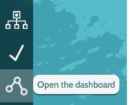
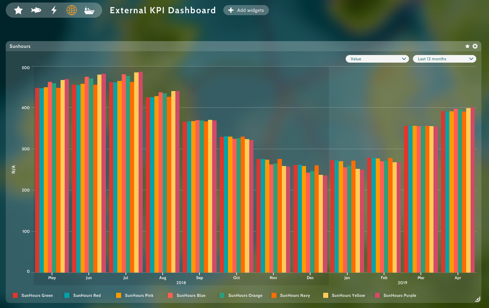
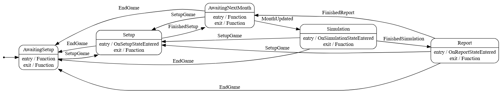

#  Brief introduction 

[MSP Challenge](https://www.mspchallenge.info/) is a simulation platform designed to support maritime spatial planning.
This platform can roughly be divided into a [server]() and
a [client](https://github.com/BredaUniversityResearch/MSPChallenge-Client) part. The server has many
[components](https://community.mspchallenge.info/wiki/Source_code_documentation), one of which is the watchdog service.
The watchdog service is responsible for managing simulations, the built-in simulations are
[Ecology](https://community.mspchallenge.info/wiki/Ecosystem_simulation_(MEL_%26_EwE)),
[Energy](https://community.mspchallenge.info/wiki/Energy_simulation_(CEL)), and
[Shipping](https://community.mspchallenge.info/wiki/Shipping_simulation_(SEL)).

These simulations are part of, and distributed with every release of the MSP Challenge server and platform.
From version [5.1](https://github.com/BredaUniversityResearch/MSPChallenge-Server/tags) onwards (its release is in March '25) it will be possible to
extend the number of simulations by external watchdog services, which can be registered to a running server.
After monthly simulations runs, KPI values will be reported to the server, shown to the user on the client.
This repository contains an ***example*** of such an external watchdog service, which "simulates" and reports the
amount of sun hours per country.

# Feedback, feature requests, bug reports and contributions

If you have feedback, feature requests, or bug reports, on the ***example***, please create an issue on the
[Github repository](https://github.com/BredaUniversityResearch/MSPChallenge-Simulation-Example/issues).

Of course we are open to contributions, please read the [contribution guidelines](https://community.mspchallenge.info/wiki/Community_Contribution) before you start.

# Contact

If you have any questions, please contact us, see the
["Contact us"-page](https://community.mspchallenge.info/wiki/Contact_us).

# Getting started

## Pre-requisites
1. Install the [MSP Challenge server](https://github.com/BredaUniversityResearch/MSPChallenge-Server), version
   [5.1](https://github.com/BredaUniversityResearch/MSPChallenge-Server/tags) (release is March '25) or higher, using docker, see the
   [Installation](https://github.com/BredaUniversityResearch/MSPChallenge-Server?tab=readme-ov-file#installation).
2. Test the server by opening the Server Manager web application in a browser, for a local development setup,
   the default url is: http://localhost/manager.
3. Install the [MSP Challenge client](https://github.com/BredaUniversityResearch/MSPChallenge-Client), version
   [5.1](https://github.com/BredaUniversityResearch/MSPChallenge-Client/releases) (release is March '25)

#  Installation

With below steps you will be copying the example repository to your own, running it,
registering it to the [MSP Challenge server](https://github.com/BredaUniversityResearch/MSPChallenge-Server), and doing
a test run with some sun hours simulation.
If that works, you can start implementing your own simulation by modifying the example code.

1. Do **not** clone this repository, but download the latest release from the [releases page](https://github.com/BredaUniversityResearch/MSPChallenge-Simulation-Example/releases) instead.
   You should create a new repository for your own simulation, and copy the contents of the example repository to your
   own repository.
2. Unzip the downloaded file to a location of your choice.
3. Open the csproj file in your favorite IDE. We tested with both JetBrains Rider and Visual Studio.
4. Let's build and run the project such that it generates a .env.local file on first launch, having a unique SERVER_ID
   uuid value. 
   This server id is used to identify the watchdog server to the
   [MSP Challenge server](https://github.com/BredaUniversityResearch/MSPChallenge-Server).
   Keep the watchdog running, waiting for connection from the server.
5. Now you need manually register the watchdog in the [Settings](http://localhost/manager/setting) of the Server Manager web application. For a local
   development setup, the default url is: http://localhost/manager/setting.
   
    Note that you need a [MSP Challenge community account](https://auth2.mspchallenge.info/register) in order to start using the software. Get an account [here](https://auth2.mspchallenge.info/register).
6. On the [Settings](http://localhost/manager/setting) page press the "More details"-icon of the "Watchdog servers" setting.
7. Add a new Watchdog server by filling in all the fields:
    - Watchdog server name. This is the name of your watchdog server, for the ***example*** this could be:
      `SunHours Example`.
    - Watchdog server id. This is the SERVER_ID value from the .env.local file. Just copy and paste it here.
    - Scheme. For dev purposes, you can use `http`.
    - Address. This is the address where the watchdog server is running. For a local development setup, where the
      watchdog server is running on the same machine as docker, you can use `host.docker.internal`.
    - Port. This is the port where the watchdog server is running. For the ***example*** this is `5026`.
    - Simulation settings. This is a json object with the settings for the simulation. Basically it holds the KPIs that
      will be reported to the server, having this structure below.
    ```json
        {
          "simulation_type": "External",
          "kpis": [
            {
              "categoryName": "...kpi category here...",
              "unit": "...kpi unit here...",
              "valueDefinitions": [
                {
                  "valueName": "...kpi name here..."
                }
              ]
            }
          ]
        }
    ```
    For the ***example*** this is:
    ```json
   {
     "simulation_type": "External",
     "kpis": [
       {
         "categoryName": "SunHours",
         "unit": "hours",
         "valueDefinitions": [
           {
             "valueName": "SunHours Green"
           },
           {
             "valueName": "SunHours Red"
           },
           {
             "valueName": "SunHours Pink"
           },
           {
             "valueName": "SunHours Blue"
           },
           {
             "valueName": "SunHours Orange"
           },
           {
             "valueName": "SunHours Navy"
           },
           {
             "valueName": "SunHours Yellow"
           },
           {
             "valueName": "SunHours Purple"
           }
         ]
       }
     ]
   }
    ```
   You can change this later on, when you have implemented your own simulation.

   Lets go through each input field:
   * simulation_type: it should always be set to value `External` since this is required by the client;
   * categoryName: its value will be shown in the title of the dashboard widget where the external KPI's presented;
   * unit: the "unit" of the KPI values. Its value will be shown in the dashboard widget. E.g. `hours`
   * valueDefinitions: each item will be a defintion of a kpi, potentially having multiple fields in future.
     - valueName: the name of KPI. Its value will be shown in the dashboard widget.

       Note that the kpi definitions are per country (- Green, - Red, etc). See [known limitations](#known-limitations).

8. Press on the "Save" button after filling in all the fields.
9. With the watchdog server still running, let's create a game session on the
   [Server manager web application](http://localhost/manager).
   Choose the "Create new session" button. A pop-up window opens and you need to fill-in the following fields:
   - Session Name: `NS`
   - Configuration Version: `North_Sea_Basic`
   - GeoServer: `default`
   - Simulation Server: `default`. This is the "internal" watchdog server used, next to any external ones registered.
     There is only one internal watchdog server at the moment, which is the one that is built-in in the
     [MSP Challenge server](https://github.com/BredaUniversityResearch/MSPChallenge-Server).
   - Admin password: `test`. You will need this password as a admin user in the client.
   - Player password. Just leave this field empty.
  
   More information on create a game session can be found on the ["Setting up your own server"-page](https://community.mspchallenge.info/wiki/Setting_up_your_own_server).
10. Press the "Create session" button. This will take a while, since the server is downloading data from the geoserver service. After session creation, it should end up in state "setup". And you will see that the server connects to your watchdog service, its console output should show something like:
    ```text
    Setting target month to -1
    Setting target game state to Setup
    Exiting AwaitingSetup state
    Transitioned from AwaitingSetup to Setup via SetupGame
    Entering Setup state
    Current state: Setup
    Found layer with ID=9, Name=NS_EEZ, GeoType=polygon.
    Retrieved additional data for Layer with id 9 having 0 layer types.
    Retrieved geometry for layer with id 9 having 9 layer objects.
    Layer object with ID=558, Type=7.
    Layer object with ID=559, Type=0.
    Layer object with ID=560, Type=1.
    Layer object with ID=561, Type=5.
    Layer object with ID=562, Type=2.
    Layer object with ID=563, Type=4.
    Layer object with ID=564, Type=4.
    Layer object with ID=565, Type=3.
    Layer object with ID=566, Type=6.
    Exiting Setup state
    Transitioned from Setup to AwaitingNextMonth via FinishedSetup
    Entering AwaitingNextMonth state
    Current state: AwaitingNextMonth
    ```
11. Congratulations, you have successfully registered your external watchdog server to the
    [MSP Challenge server](https://github.com/BredaUniversityResearch/MSPChallenge-Server), and created a game session.
    Either go ahead and implement your own simulation, or continue on playing with the ***example*** simulation.
    - For playing with the ***example*** simulation, check the [Usage](#usage) section.
    - For implementing your own simulation, first read the [Watchdog program.cs](#watchdog-programcs) section to
      understand the structure of the program.

# Usage

With the watchdog server connected to the
[MSP Challenge server](https://github.com/BredaUniversityResearch/MSPChallenge-Server), and a game session created,
you can now start the [client](https://github.com/BredaUniversityResearch/MSPChallenge-Client) and
[join the game session](https://community.mspchallenge.info/wiki/Connecting_to_a_server).
For a local development setup, just use `localhost` as the server address.

To learn more about how to run simulations from the client, I advise you to go through the tutorial which is included in
the client itself, also explained [here](https://community.mspchallenge.info/wiki/Basic_features).
And how to manage the simulated time as an session administrator [here](https://community.mspchallenge.info/wiki/Administrator_features).

To view the KPIs, follow these steps:
1. You need to open the dashboard in the client by pressing the "Dashboard" button on the left side menu.

   
2. On the dashboard, choose the "Other"-category button (the globe) in the top menu.
   In the image below, it has been selected, and it is colored orange:

   
3. Now you should see the dashboard widget showing the KPIs for the sun hours simulation, eg. when the simulation has run for a year or more:



So for each country a KPI value is shown per month.

# Watchdog program.cs

The [program.cs](https://github.com/BredaUniversityResearch/MSPChallenge-Simulation-Example/blob/main/Program.cs) file
is the entry point of the watchdog server. Let me go through it step by step.

Look at the first lines:
```csharp
// note that this program is designed to only handle one game session at a time
//   any new game session will be ignored until the current game session is finished
var program = new ProgramManager(args);
var kpis = new List<KPI>();

program.OnSimulationDefinitionsEvent += OnSimulationDefinitionsEvent;
program.OnQuestionAcceptSetupEvent += OnQuestionAcceptSetupEvent;
program.OnSetupEvent += Setup;
program.OnReportStateEnteredEvent += () => Task.FromResult(kpis);
program.Run();
```

The first line is a comment, stating that this program is currently designed to only handle one game session at a time.
If you need to handle multiple game sessions, you will need to:
* run multiple instances of the program on different ports, registering each to the server with a different server id uuid;
  
  (it would also require each instance to only accept a specific game session - see program.OnQuestionAcceptSetupEvent -
  otherwise a single game session would be simulated by multiple instances, potentially causing duplicate KPIs)

The ProgramManager class is the main class used, it handles:
* creating an initial .env.local file with a unique SERVER_ID uuid value;
* reading and handling command line arguments, which are:
  - --port: Set the port the API server is running on
  - --dotfile: Output the DOT file to the specified path. You can view it on http://www.webgraphviz.com/. E.g.:
    
  - --https-redirection: Enable or disable HTTPS redirection
* generating and opening a swagger UI showing the API of the watchdog server;
* the connection to the server, as-in serving an API for the server to connect to, as well as setting up a http client
  to connect to the server's API;
* validating and handling incoming requests from the server;
* authorization, including refreshing the server's api access token;
* ping-pong responses, to keep the connection alive;
* polling if the game session is still active; and if not resetting the watchdog server to await a new game session;
* controlling the flow of the game session states: awaiting setup, setup itself, awaiting next month, simulation, reporting;
* on setup, registering the simulation definitions to the server, which are defined in program.cs;
* on reporting, returning the KPIs to the server, which are defined in program.cs;

This line:
```csharp
program.OnSimulationDefinitionsEvent += OnSimulationDefinitionsEvent;
```
registers the OnSimulationDefinitionsEvent event, which returns the simulation definitions and are sent to the server
during the setup state.
It looks like this:
```csharp
List<SimulationDefinition> OnSimulationDefinitionsEvent(GameSessionInfo gameSessionInfo)
{
    // here you can decide based on the game session info data what simulations you want to run
    // e.g. a watchdog could have multiple simulations, but you only want to run some of them
    return [new SimulationDefinition("SunHours", "1.0.0")];
}
```
Note the event method gets a GameSessionInfo object as a parameter, which contains information about the game session.
Here you can decide which simulations you want to register to which game session.

This line:
```csharp
program.OnQuestionAcceptSetupEvent += OnQuestionAcceptSetupEvent;
```
registers the OnQuestionAcceptSetupEvent event, which returns a boolean value indicating if the watchdog server accepts
the setup of the game session.
It looks like this:
```csharp
bool OnQuestionAcceptSetupEvent(GameSessionInfo gameSessionInfo)
{
    // here you can decide based on the game session info data if you want to accept this game session or not
    return "North_Sea_basic" == gameSessionInfo.config_file_name; // the only one with layer tags
}
```
In the ***example***, the watchdog server only accepts the game session if the config file name is "North_Sea_basic".
The only one with layer tags at the point of writing this. Which is required for the simulation setup, as we will see.

This line:
```csharp
program.OnSetupEvent += Setup;
```
registers the OnSetupEvent event, which is called when the game session is in the setup state. It allows you to gather
data from the server, which is required for the simulation setup. In the ***example***, we fetch all polygons in the EEZ
layer, which are used to calculate the sun hours per country.

It looks like this: (simplified version)
```csharp
    return program.GetMspClient().HttpPost<List<LayerMeta>>(
        "/api/Layer/List", new NameValueCollection {
           { "layer_tags", "EEZ,Polygon" }
       }
    ).ContinueWithOnSuccess(layerListTask =>
    {
        var layers = layerListTask.Result;
        var layer = layerListTask.Result[0];
        return (layer, program.GetMspClient().HttpPost<LayerMeta>(
            "/api/Layer/Meta",
            new NameValueCollection {
                { "layer_id", layer.layer_id.ToString() }
            }));
    }).ContinueWithOnSuccess(dataset =>
    {
        var (layer, layerMetaTask) = dataset.Result;
        var layerWithMeta = layerMetaTask.Result;
        return (layerWithMeta, program.GetMspClient().HttpPost<List<SubEntityObject>>(
            "/api/Layer/Get",
            new NameValueCollection {
                { "layer_id", layer.layer_id.ToString() }
            }));
    }).ContinueWithOnSuccess(dataset =>
    {
        var (layer, layerGetTask) = dataset.Result;
        var layerObjects = layerGetTask.Result;
        program.OnSimulationStateEnteredEvent += (month) =>
            OnSimulationStateEnteredEvent(month, layer, layerObjects);
    });
```
So, this basically chains a couple of http requests together, to get the required data for the simulation setup.
The executed code is fully asynchronous, and the next step is only executed when the previous step is finished.
Note that the last line registers the OnSimulationStateEnteredEvent event, which is called on each monthly
simulation given the month number, the layer, and the layer objects.

The simulation looks like this (simplified version):
```csharp
Task OnSimulationStateEnteredEvent(
    int month,
    LayerMeta eezLayer,
    List<SubEntityObject> eezLayerObjects
) {
    return program.GetMspClient().HttpPost<YearMonthObject>(
    "/api/Game/GetActualDateForSimulatedMonth",
        new NameValueCollection
        {
            { "simulated_month", month.ToString() }
        }
    ).ContinueWithOnSuccess(task => {
        var yearMonthObject = task.Result;
        CalculateKpis(month, yearMonthObject, eezLayer, eezLayerObjects);
    });
}
```
This method calculates the KPIs for the given month, based on the actual date for the simulated month, the EEZ layer,
and the EEZ layer objects. In the ***example***, it calculates the sun hours per country. See the [CalculateKpis](https://github.com/BredaUniversityResearch/MSPChallenge-Simulation-Example/blob/2f769c9d89c2bb1d8cf3d1a3c6a47c1442a59461/Program.cs#L120) method.
The CalculateKpis method just adds KPI's to kpis list like so:
```csharp
var kpi = new KPI()
{
   name = $"SunHours {layerType.Value.displayName}",
   type = "EXTERNAL",
   value = sunHoursPerCoordinate.Average(),
   unit = "hours",
   month = simulatedMonthIdentifier,
   country = -1 // for now, the server only supports showing non-country specific external KPIs
   //country = layerType.Value.value // eez layer type value = country id
};
Console.WriteLine($"KPI: {kpi.name}, Value: {kpi.value} {kpi.unit}");
kpis.Add(kpi);
```

This line:
```csharp
program.OnReportStateEnteredEvent += () => Task.FromResult(kpis);
```

registers the OnReportStateEnteredEvent event, which is called after the simulation state, and submits the KPIs to the
server.

Finally this line:
```csharp
program.Run();
```
This starts the watchdog server.

# How to get data from the server

The watchdog server can get data from the server by using the
[MspClient](https://github.com/BredaUniversityResearch/MSPChallenge-Simulation-Example/blob/main/Communication/MspClient.cs),
of which you can get an instance by calling the
[GetMspClient()](https://github.com/BredaUniversityResearch/MSPChallenge-Simulation-Example/blob/48714bf665254fe0e9846b37f3710b814522b7fc/ProgramManager.cs#L219)
method on the
[ProgramManager](https://github.com/BredaUniversityResearch/MSPChallenge-Simulation-Example/blob/main/ProgramManager.cs)
object.

All data available by server api calls can be found - and tested - on the server api Swagger UI, which can be accessed by opening
/api/doc on the server host, e.g. for the local development setup: http://localhost/api/doc.

Most of the calls require an api access token, which will be handled by the Program manager and the MspClient as follows:
* on receiving a /Watchdog/UpdateState request it will receive a token (see [here](https://github.com/BredaUniversityResearch/MSPChallenge-Simulation-Example/blob/48714bf665254fe0e9846b37f3710b814522b7fc/ProgramManager.cs#L326));
* the MSP client will use this token for all subsequent requests using a Bear token authorization header (see [here](https://github.com/BredaUniversityResearch/MSPChallenge-Simulation-Example/blob/48714bf665254fe0e9846b37f3710b814522b7fc/Communication/MspClient.cs#L48));
* every 15 minutes the token will be refreshed by the Program manager (see [here](https://github.com/BredaUniversityResearch/MSPChallenge-Simulation-Example/blob/48714bf665254fe0e9846b37f3710b814522b7fc/ProgramManager.cs#L59)).

So, if you want to test an api call using the Swagger UI, start with these steps first:
1. On the top there is a "sessionId" field, fill in the id of the game session as mention on the [Server Manager web application](http://localhost/manager).
2. In the "User" section, select /api/User/RequestSession to uncollapse it.
3. Press the "Try it out" button.
4. Fill in the required fields. You can leave build_timestamp and country_id to the default values.
   Fill-in your [community](https://community.mspchallenge.info) username and set the "country password" to the Admin
   password you set when creating the game session.
5. Press the "Execute" button.
6. The response is a json object with a payload field. Inside the payload there is a field called "api_access_token".
    Copy this value into the clipboard. Only select the characters inside the quotes, not the quotes themselves.
7. On the top right press the "Authorize" button.
8. In the "Value" field, paste the api access token and press the "Authorize" button, followed by the "Close" button.
9. Now you can test any api call, and it will use the api access token you provided.

One of the [HttpPost](https://github.com/BredaUniversityResearch/MSPChallenge-Simulation-Example/blob/48714bf665254fe0e9846b37f3710b814522b7fc/Communication/MspClient.cs#L79)
calls of the MspClient is templated and expects a type to be returned. E.g.
```csharp
program.GetMspClient().HttpPost<YearMonthObject>(
    "/api/Game/GetActualDateForSimulatedMonth",
    new NameValueCollection
    {
        { "simulated_month", month.ToString() }
    }
);
```
returns an instance of
[YearMonthObject](https://github.com/BredaUniversityResearch/MSPChallenge-Simulation-Example/blob/main/Communication/DataModel/YearMonthObject.cs).
There a quite some data models defined in the
[DataModel](https://github.com/BredaUniversityResearch/MSPChallenge-Simulation-Example/tree/main/Communication/DataModel) folder.
But if you need to get data from the server that is not yet defined, you can create a new data model class, and use it in
the HttpPost call.

Note that the Swagger UI also provides the json schema of the data models, which can be used to create the data model classes.

If the server api is lacking a call you need, you can request it on the [Github repository](https://github.com/BredaUniversityResearch/MSPChallenge-Simulation-Example/issues).

# Testing using .http files

JetBrains Rider supports .http files through its built-in HTTP client. This allows you to create and execute HTTP
requests directly from the IDE. You can find more information about this feature in the
[JetBrains documentation](https://www.jetbrains.com/help/idea/http-client-in-product-code-editor.html).

In the folder [.http](https://github.com/BredaUniversityResearch/MSPChallenge-Simulation-Example/tree/main/.http)
you can find some example .http files, which you can use to test the watchdog server. You can run these files by
clicking on the "Run all requests in file"-button that appears when you open the file in Rider.
Let me go through the different available .http files, which should be executed in order:

* [1.Watchdog-UpdateState-Setup.http](https://github.com/BredaUniversityResearch/MSPChallenge-Simulation-Example/tree/main/.http/1.Watchdog-UpdateState-Setup.http):
  This file contains a request to update the state of the watchdog server to given game state change to "Setup", which is month -1.

  Do not forget to set the correct values for variables:
  - @MSP_Server_Api_Address, the address of the server api incl. the session id, e.g. `http://localhost/1/` or `https://server.mspchallenge.info/1/`
    
    (the default `http://mitmproxy:8080/1/` is the default local development setup and allows you to monitor server network traffic on http://localhost:8081);
  - @Username, for request an api access token using /api/User/RequestToken;
  - @MSPChallenge_Simulation_HostAddress, the local address of the watchdog server incl, port, e.g. `http://localhost:5026/`;
  - @GameSessionToken, token of the game session, needed to identify the connecting game session. You can set this to any string.
* [2.Watchdog-UpdateState-Simulate.http](https://github.com/BredaUniversityResearch/MSPChallenge-Simulation-Example/blob/main/.http/2.Watchdog-UpdateState-Simulate.http):
  This file contains a request to update the state of the watchdog server to given game state change to "Pause", which is month 0.
  This will trigger the first monthly simulation.

  Do not forget to set the correct values for those variables. The value of @GameSessionToken should match the value set in
  the previous file, otherwise the watchdog server will reject the request with a 405 Method Not Allowed.

* [3.Watchdog-SetMonth.http](https://github.com/BredaUniversityResearch/MSPChallenge-Simulation-Example/blob/main/.http/3.Watchdog-SetMonth.http):
  This file contains a request to simulate to a specific month as given by the variable @TargetMonth (default=4).
  You can repeat this request to simulate towards different target months.

  Again, do not forget to set the correct values for all the variables.
* [4.Watchdog-UpdateState-End.http](https://github.com/BredaUniversityResearch/MSPChallenge-Simulation-Example/blob/main/.http/4.Watchdog-UpdateState-End.http):
  This file contains a request to update the state of the watchdog server to given game state change to "End".
  The default is month 4 as given by variable @TargetMonth.
  This will reset the watchdog to its initial state, awaiting a new session and its setup.
  
  Again, do not forget to set the correct values for all the variables.

# Known limitations

* The server only supports showing non-country specific external KPIs. This means that the country field of the KPI
  object should be set to -1.
  See [here](https://github.com/BredaUniversityResearch/MSPChallenge-Simulation-Example/blob/15b2a2092fdfa060ea550dc40072fb0836ae43ef/Program.cs#L172).
  This is because the server does not yet support showing country specific external KPIs.

  This limitation will be removed in future versions of the msp challenge platform. The issue has been reported [here](https://github.com/BredaUniversityResearch/MSPChallenge-Client/issues/261).

# License

See [Terms & Conditions](https://community.mspchallenge.info/wiki/Terms_%26_Conditions)

# Sequence diagram

The sequence diagram below shows the flow of the watchdog server, from setup to monthly simulation to reporting.


